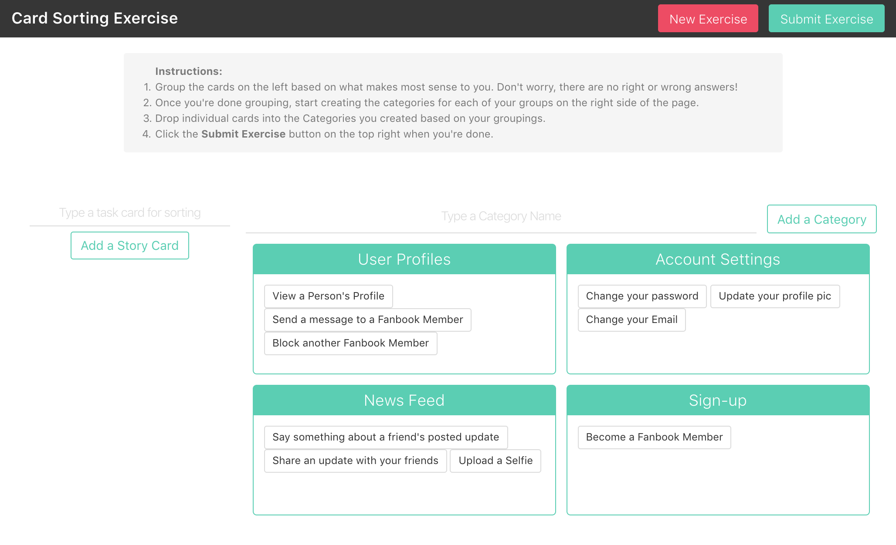

## Card Sorting
Card sorting is a technique in UX Design in which a group of subject experts or users are tested to help generate a dendrogram or folksonomy. It’s a useful approach for designing information architecture, workflows, menu structure, or web site navigation paths.

## How to Use
Read the instructions in the [demo](http://card-sorting-exercise.surge.sh/)

## Installation

- Fork and clone this repository
- Run `npm install` to get all dependencies. Make sure you have [nodejs](http://nodejs.org) already installed beforehand.
- See the scripts section of the package.json for terminal commands for javascript and sass compiling

## Updates
Please submit a [pull request](https://github.com/katrinasilver/card-sorting/pulls) if you would like to contribute to this repository

## Issues
Post bugs and issues [here](https://github.com/katrinasilver/card-sorting/issues)
